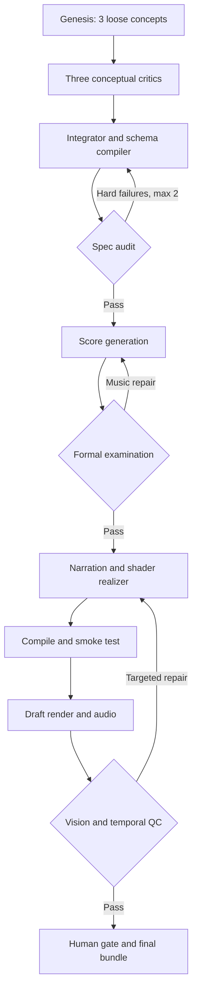

# Transmission 5

You're close, but I would not implement the pipeline exactly as written. The crucial upgrade is to separate three loops: conception, realization, and perception. Right now the Integrator is doing too much, and the workflow has no explicit step that actually writes the GLSL, narration, and executable composition files.

## Four corrections to your predictions

| Your prediction                      | Verdict    | Correction                                                                                                 |
| ------------------------------------ | ---------- | ---------------------------------------------------------------------------------------------------------- |
| Genesis should have no schema        | Almost     | No production schema, but use a loose creative envelope so candidates remain comparable.                   |
| Epistemic Prosecutor needs sources   | Yes        | Never treat model training knowledge as evidence. Supply a versioned source capsule.                       |
| Transfer rejected alternatives       | Yes        | Transfer the reason they failed, not a permanent blacklist.                                                |
| Generate MIDI before Formal Composer | Half right | A Formal Architect designs the form before generation; a Formal Examiner audits its realization afterward. |

### 1. Genesis: free, but not shapeless

Creativity-first means Genesis should not produce waypoints, uniforms, stage durations, or validator-friendly K4 endings. But completely unconstrained free-form output makes integration unreliable.

Use a lightweight envelope:

```json
{
  "central_question": "...",
  "felt_transformation": "...",
  "thesis_hypothesis": "...",
  "causal_mechanism": "...",
  "musical_form_candidates": [],
  "visual_world_candidates": [],
  "behavioral_axis_hypotheses": [],
  "epistemic_claims": [],
  "creative_risks": [],
  "rejected_directions": []
}
```

Fields can contain long prose and unconventional structures. The rule is: conceptual commitments only, no runtime implementation.

### 2. The attribution document

For the first Weaver prototype, one compact document can be sufficient—but only if the Prosecutor is explicitly a **closed-corpus auditor**.

Use two layers:

* `CANONICAL-INVARIANTS.json`: tattva numbering, śūnyatā distinctions, entropy/open-system qualifications, category boundaries between physics and metaphysics.
* `TOPIC-SOURCE-CAPSULE.json`: 15–40 claim cards selected for this composition.

Each claim card should contain:

```json
{
  "source_id": "prigogine_1977",
  "claim": "Dissipative organization requires sustained throughput.",
  "scope": "open nonequilibrium systems",
  "status": "supported",
  "tradition": "thermodynamics",
  "does_not_entail": "that vibration metaphysically precedes matter"
}
```

The Prosecutor may return:

* `supported`
* `contradicted`
* `category_error`
* `overstated`
* `not_grounded_in_supplied_corpus`

Model memory may inspire Genesis, but it should never pass an epistemic gate. For arbitrary future topics, a five-fact prompt sheet will not scale; retrieve topic-specific cards from a curated R2/Vectorize corpus.

For rejected alternatives, store:

```json
{
  "pattern": "central luminous deity",
  "why_failed": "implied a permanent executive center",
  "evidence": "weakened the multiplicity thesis",
  "when_it_might_work": "an essay specifically arguing for hierarchical emanation"
}
```

That transmits judgment without freezing the style.

### 3. Integrator loop

Use one compilation pass followed by at most two targeted repair passes:

1. Integrator selects/synthesizes a candidate.
2. Schema Compiler produces `composition.v1.json`.
3. Deterministic auditor emits JSON Patch failures.
4. Integrator applies only hard-failure patches.
5. Re-audit.
6. Escalate to human review after two unsuccessful repairs.

Do not ask Gemma to regenerate the whole composition after each failure. That causes "validator drift": the concept becomes progressively safer and more generic.

Advisory failures should not block realization. Only contradictions, missing causal mappings, invalid timing, schema failures, unsupported factual claims, and executable-interface failures should be hard gates.

### 4. Formal Composer ordering

Split it into two roles:

* **Formal Architect, pre-score:** chooses the musical form, transformation operators, voice roles, cadential logic, and why these are structurally homologous to the thesis.
* **Formal Examiner, post-score:** examines actual MIDI events, registered voices, displacement, crossing, motif transfers, tonal hierarchy, and whether the promised form was actually realized.

The score generator therefore sits between them. Music should then lead the remaining realization: narration timing and shaders consume the actual score feature bus rather than an imagined one.

## Recommended pipeline



Your current design is missing `Narration and Shader Realizer`. Nothing presently generates the `glsl/*.glsl`, executable scripts, or final essay from the audited concept.

## Vision QC resolution

`360×203` is enough to detect blackouts, missing objects, gross imbalance, and stage differentiation. It is not enough to judge shader detail, texture, typography, edge quality, subtle color interaction, or whether the continuity object remains legible.

For the prototype:

* Individual frames: `768×432` PNG.
* Semantic/layout review: 280 visual tokens.
* Fine recognition frames: 560 tokens.
* Chronological contact sheets: `1536×864`, 1120 tokens.
* Maximum 6–9 panels per contact sheet.
* Split the composition into opening, complication, recognition, and return sheets.

Gemma 4 supports visual budgets of 70, 140, 280, 560, or 1120 tokens; Cloudflare's hosted model is currently listed as vision-capable with a 256K context window. [Google Gemma vision documentation](https://ai.google.dev/gemma/docs/capabilities/vision), [Cloudflare Gemma 4 model page](https://developers.cloudflare.com/workers-ai/models/gemma-4-26b-a4b-it/)

Static frames cannot validate animation. Add chronological strips containing six frames over 2–4 seconds around every important transition. Ask QC explicitly:

* What persisted?
* What transformed?
* What visually caused the transformation?
* Could the frames be accidentally reordered without anyone noticing?

If they can be reordered, the animation lacks visible causality.

## Causal-memory τ

For median waypoint intervals near 50 seconds, start with:

```
τ = 0.5 * T_median ≈ 25 seconds
```

After 50 seconds, a 25-second filter reaches about 86% of a new target. At τ=60 seconds it reaches only about 57%, which will smear distinct stages.

Use two timescales if possible:

* `τ_fast = 8–12s`: visual continuity and local aftereffects.
* `τ_memory = 25s`: semantic memory across a stage.
* Optional `τ_recognition = 50s`: only for the persistent ground/recognition trace.

Also fix the integrator. Explicit `dt / tau` is frame-rate sensitive, and the current `lag` property references an undefined `dt` while returning an update coefficient rather than lag.

```python
class CausalMemory:
    def __init__(self, tau: float = 25.0):
        self.tau = tau
        self.trace = [0.0] * 6
        self.target = [0.0] * 6

    def update(self, target: list[float], dt: float) -> list[float]:
        self.target = target.copy()
        tau = max(self.tau, 1e-4)
        alpha = -math.expm1(-dt / tau)

        for i in range(6):
            self.trace[i] += alpha * (target[i] - self.trace[i])

        return self.trace.copy()

    @property
    def lag_vector(self) -> list[float]:
        return [
            self.target[i] - self.trace[i]
            for i in range(6)
        ]

    @property
    def lag_magnitude(self) -> float:
        return math.sqrt(
            sum(x * x for x in self.lag_vector) / 6.0
        )
```

One further conceptual warning: a filtered copy of the 6D state proves only that the engine has lag. For Weaver, also accumulate actual transfer events—who carried the ground, what transformation occurred, and how far it moved from the original. Otherwise the engine remembers axis values but not the musical identity whose persistence is the thesis.

## Cloudflare corrections

There are three practical errors in the proposed implementation:

* Workflows use a `WorkflowEntrypoint` class with `run(event, step)`, not the shown `default.start`.
* The human gate should use `step.waitForEvent()`, allowing `/approve` and `/reject` to resume the existing workflow. Cloudflare documents this exact human-approval pattern. [Cloudflare human-in-the-loop example](https://developers.cloudflare.com/workflows/examples/wait-for-event/)
* Do not assume CPU GLSL rendering fits inside Workers. Free Workflow steps receive only 10 ms active CPU; Paid defaults to 30 seconds and can be configured to five minutes, with 128 MB isolate memory. Workflows provide unlimited waiting time, not unlimited computation. [Cloudflare Workflow limits](https://developers.cloudflare.com/workflows/reference/limits/), [Workers limits](https://developers.cloudflare.com/workers/platform/limits/)

The safe architecture is: Cloudflare orchestrates, stores, and audits; a small external SwiftShader/WebGL render service performs drafts and writes results to R2. You can experimentally test Browser Rendering, but do not design around WebGL availability until a shader smoke test succeeds.

Finally, the cost estimate is low. From your own token counts—17K input and 18K output—Gemma 4 currently costs approximately:

```
17K (0.10/M) + 18K (0.30/M) = $0.0071
```

That is roughly 645 neurons, not 198K. The 10K-neuron daily allowance therefore supports about 15 one-pass compositions, probably 5–10 after repair and vision loops—not 50. [Current Workers AI pricing](https://developers.cloudflare.com/workers-ai/platform/pricing/)

The architecture is fundamentally good. The decisive changes are: loose-envelope Genesis, evidence capsules rather than model memory, separate pre/post musical critics, an explicit Realizer, genuine event memory, and targeted bounded repair loops.
